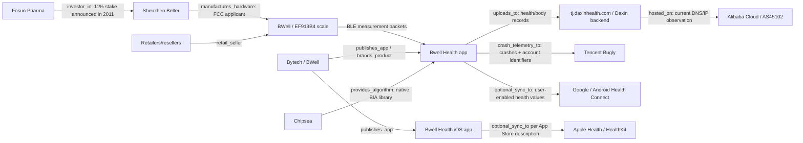

# Data Sharing Graph

This document tracks the current data-sharing graph for the BWell smart-scale ecosystem. It uses evidence-labeled edges so that proven paths, likely business relationships, and speculative leads do not get mixed together.

## Summary Graph

## Proven Data Flows

| From | To | Edge | Data involved | Evidence level | Notes |
|---|---|---|---|---:|---|
| Scale | Bwell Health Android app | BLE measurement packets | Weight, fat raw/percent, timestamp, resistance/impedance, unit/status bytes | High | Confirmed by app protocol and live BLE work. |
| Bwell Health Android app | `tj.daxinhealth.com` | `uploads_to` | Final body-composition records, user id, test date | High | Hardcoded backend and upload method. |
| Bwell Health Android app | Tencent Bugly | `crash_telemetry_to` | Crash/exception telemetry plus app-set user identifiers | High | App initializes Bugly and sets user id/email/mobile/nickname after login. |
| Bwell Health Android app | Android Health Connect | `optional_sync_to` | Weight, body fat, BMR, bone mass/mineral value, timestamp | High | App code path exists and is user/permission controlled. |

## Proven Non-Data Or Supply-Chain Relationships

| Entity | Relationship | Evidence level | Notes |
|---|---|---:|---|
| Bytech / BWell | App publisher / retail brand | High | Google Play and Apple App Store list Bytech/Bytech NY; Bytech has BWell brand pages. |
| Shenzhen Belter | FCC applicant/manufacturer for EF919B4 | High | FCC filing. |
| Chipsea | Native BIA algorithm provider | High | App includes Chipsea native library and calls it locally. |
| Fosun Pharma | Investor/associate relationship with Shenzhen Belter | Medium-high | Public Fosun announcement says 11% stake; no data-flow evidence. |
| Alibaba Cloud / AS45102 | Current hosting/network for resolved backend IP | Medium | DNS/IP observation can change. Infrastructure role only. |

## Plausible But Not Proven Relationships

| Relationship | Why plausible | What would prove it |
|---|---|---|
| Bytech has backend/admin access to Daxin-hosted BWell records | Bytech is app publisher and BWell brand owner, while backend is Daxin. App operation likely requires support/operations access. | Contract, admin endpoint evidence, policy disclosure, or direct statement. |
| Daxin shares BWell data with affiliates | Daxin privacy language allows sharing within company or affiliated enterprises. | Product-specific policy naming affiliates, data-processing agreement, or backend/vendor disclosure. |
| Bugly crash records include some scale/request data during errors | App posts caught HTTP/JSON exceptions and attaches user identifiers. Exceptions around upload/parsing may include request/response context. | Captured Bugly payload or app path proving measurement fields are placed in exception text. |
| Bytech related apps use the same backend stack | Bytech publishes several health/device apps; Sealy Smart Scale package name includes `daxin`. | APK/code review of each related app. |
| Belter receives app records | Belter is OEM/FCC applicant and may provide SDK/protocol code. | Backend domain, policy, contract, or network evidence tying upload to Belter. |
| Chipsea receives runtime measurements | Chipsea provides local native library and markets app/cloud solutions. | Network evidence to Chipsea domain or policy saying Chipsea processes app data. |

## Current Node Inventory

| Node | Type | Website | Data role |
|---|---|---|---|
| Bytech Intl / BYTECH NY, INC. | App publisher / brand owner | https://www.bytechintl.com/ | Consumer-facing app/brand role. Direct backend access not proven. |
| BWell brand | Brand | https://bwellmonitors.com/ | Brand/product identity. |
| Guangzhou Daxin Health Technology Co., Ltd. | Backend/domain operator candidate | https://en.daxinhealth.com/ | Backend domain receives health records. |
| Shenzhen Belter Health Measurement and Analysis Technology Co., Ltd. | Hardware/OEM | Public pages cite `belter.com.cn`, `belterhealth.com` | FCC applicant/manufacturer. |
| Chipsea Technologies (Shenzhen) Corp. | Algorithm/chip provider | https://en.chipsea.com/ | Native body-composition library runs locally. |
| Tencent Bugly | Telemetry SDK | https://bugly.tds.tencent.com/ | Proven telemetry recipient. |
| Google / Android Health Connect | Optional platform health store | https://developer.android.com/health-and-fitness/health-connect | Optional user-permission health data write. |
| Apple / HealthKit | Optional platform health store | https://developer.apple.com/documentation/healthkit | iOS optional health sharing per App Store description. |
| Alibaba Cloud / AS45102 | Infrastructure | https://www.alibabacloud.com/ | Current backend IP infrastructure observation. |
| Fosun Pharma | Investor | https://www.fosunpharma.com/ | Investor/associate context for Belter; no data role proven. |
| Retailers/resellers | Sales channel | Varies | Product sale only; no measurement data path observed. |

## Data Box Analysis

The app does not keep sensitive data in one privacy box:

| Box | Data in that box | Risk |
|---|---|---|
| Daxin backend | Health/body-composition records, account/profile/device/app metadata | Receives the core sensitive data. |
| Tencent Bugly | Crash/exception telemetry plus user id/email/mobile/nickname | Identifiable telemetry and possible health/request context during failures. |
| Phone local storage | Saved credentials, local queues, profile state, history records | Local extraction risk. |
| Health Connect / Apple Health | Optional selected health values | User-permission controlled, but creates another copy/path. |
| Infrastructure provider | Hosting/network/log metadata, depending Daxin deployment | Infrastructure custody, not independent use proven. |

## Research Tasks

| Priority | Task |
|---:|---|
| 1 | Capture and archive Bytech/BWell privacy policy pages and identify whether they cover Bwell Health specifically. |
| 1 | Capture Daxin privacy/legal pages in English and Chinese if available. |
| 1 | Compare Google Play Data Safety and Apple App Privacy declarations against Android app evidence. |
| 1 | Review Tencent Bugly SDK privacy statement for collected identifiers and crash data content. |
| 2 | Review Bytech's related health/device apps for shared package names, backends, SDKs, and privacy labels. |
| 2 | Identify Daxin affiliates and apps, then review their policies. |
| 2 | Search credible breach/regulatory sources for each high-priority company. |
| 3 | Review Belter and Chipsea only for data-flow evidence, SDK terms, and regulatory reputation. |
| 3 | Track hosting/IP changes for `tj.daxinhealth.com`. |

